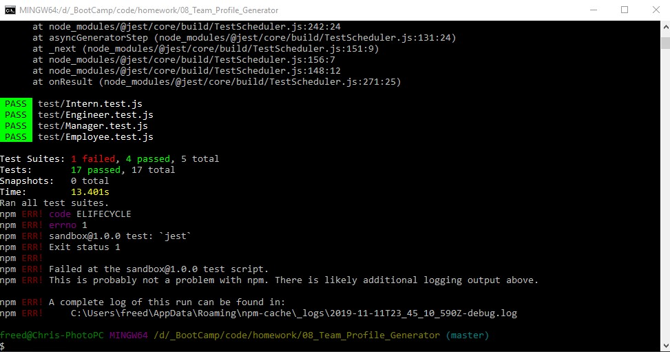

# 08_Team_Profile_Generator

### Table of Contents
- [Description](#Description)
- [Technologies-Libraries](#Technologies-Libraries)
- [Screenshots](#Screenshots)
- [Link](#Link)
​
### Description
This assignment is a software engineering team generator command line application. The application prompts the user for information about the team manager and then information about the team members. The user can input any number of team members, and they may be a mix of engineers and interns. This assignment also passes a jest unit tests. When the user has completed building the team, the application creates an HTML file that displays a formatted team roster based on the information provided by the user. 

### Technologies-Libraries
- [NodeJS](https://nodejs.dev/) - Server side code
- [inquirer](https://www.npmjs.com/search?q=inquirer) - User inputs on the command line
​
### Screenshots
​

​
### Link
Check it out! 
https://github.com/chrisneal72/08_Team_Profile_Generator
https://chrisneal72.github.io/08_Team_Profile_Generator/output/